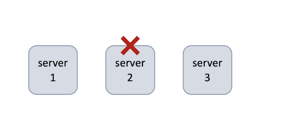

# 2. Fault tolerance, resilience, reliability

> Fault tolerance is the property that enable a system to continue operating properly in the event of one or more faults within some of its components

1. Error, fault, failuer
1. Fault tolerance
1. Resilience
1. Game day vs chaos engineering
1. Expected and unexpected failures
1. Reliability

**software engineer**

> sometimes I make mistakes **errors**. Oops.. I have got a bug (**fault**)

And, it may cause a failure of one of my components.

**customer**

> Because your system is fault-tolerant, I do not see any **failures**

A highly availability system accepts the fact that downtime is possible and the system tries to minimize it.

A fault tolerant system has the goal of zero downtime.

> A car and an aeroplane analogy. In a car, we have an extra tire. Incase of one tire failure, we can stop the car and quickly change the broken tire. There is a downtime but it's short. Think of a car as a highly available system. An aeroplane can't stop in case of a failed engine. Other engines have to take over to ensure zero downtime. Not forever but till the next stop. An aeroplane is a fault tolerant system.

1. Achieved by using the same design principles and processes as for high availability
1. Requires even more redundancy typically highly than required in highly availability
1. Results in a higher cost

we can interchangebly use the fault tolerant with high availability

**resilience**

Ability to quickly recover from failures

Enigneer

> **Note**: I need faults to happen in my sytem periodically to test resilience (fault tolerance)

Chaos engineering rocks!

> Randomly killing an instance of a server to help simulates various system failures. Chaos engineering may remind you of the game day process mentioned earlier, but not the same. Game day is more focused on the team and the sections. They help the team to build muscle memory on how to respond to events. Chaos engineering is forcused on system behavior. It's goal is to automate experiments and run them continuosly in production

**reliability**

This means the system always performs its intended functions correctly and in time

1. High availability
1. Correctness
   > System returns the correct result
1. In time
   > system replies back within an acceptable time

System know how to handle expected failures (reliability & high availability):

1. server crash
1. power outage in a data center
1. network problems

System knows how to handle unexpected failures (fault tolerant & resilience):

1. load spikes
1. dependency failures
