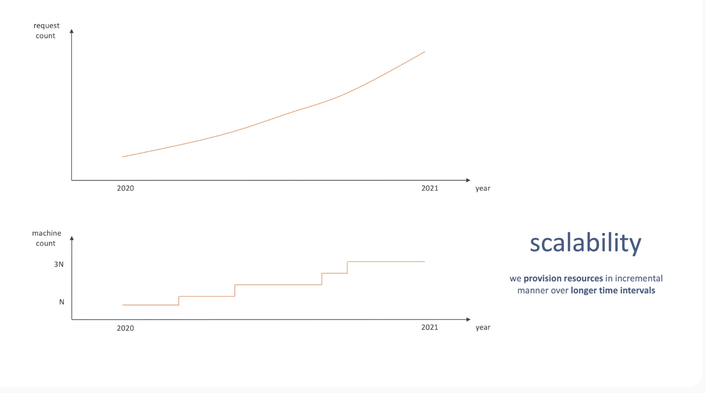

# 3. Scaling

The property of a system to handle a growing load

1. Requests per second
1. volume of incoming or outgoing data
1. number of concurrent connections etc.

Ways to scale

1. Vertical scaling

   1. More client
   1. More CPU / bigger server

1. Horizontal scaling (scaling out / shared-nothing architechture – SNA)
   1. More clients
   1. Add more machines to the system

> Typical you would prefer to scale horizontally. Vertical scaling is limited as the bigger or more powerful machines might be expensize. However you can always add more machines to the systems while growing horizontally

Problems to solve with horizontal scaling

1. service discovery
1. load balancing
1. request routing problem
1. maintenance

**softwate engineer**

> I still think that every system must run on multiple machines these days. It allows to have redundant machines in the system. Thus, increases availability.

> however, it is possible to achieve high availability in a single machine (almost.. ) system. Relational databases and load balancers often use active/passive setup for this.

Horizonal and vertical scaling can be used in conjunction

**Elasticity**

the ability of a system to acquire resources as it needs them, and release resources when it no longer needs them. $elasticity \ne scalability$

Elasticity is about short-term, tactical needs. Maybe the requests are higher during the day and lower in the evening. You can set 2N machines working when requests are high and 1N when requests are low as needed.

Elasticity helps to reduce costs

Scalability is about long-term, strategic needs. As our system grows throughout the year we can plan to deploy more resources to keep up the growing demands/requests.
