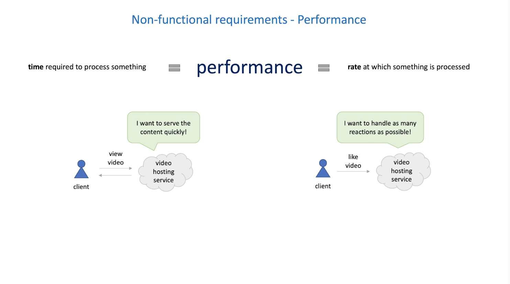
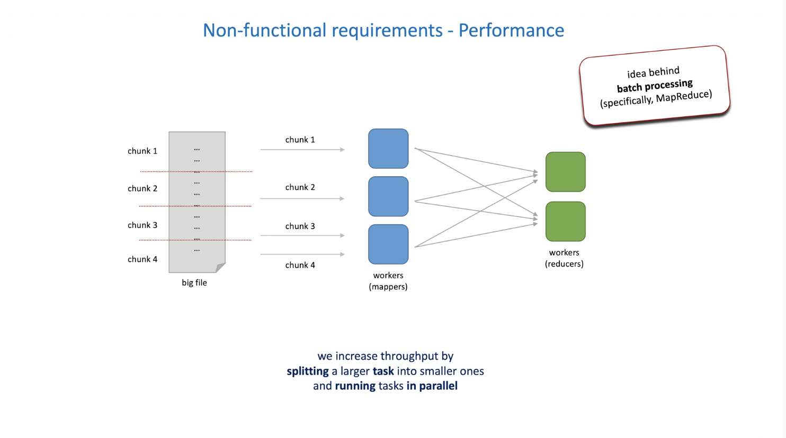
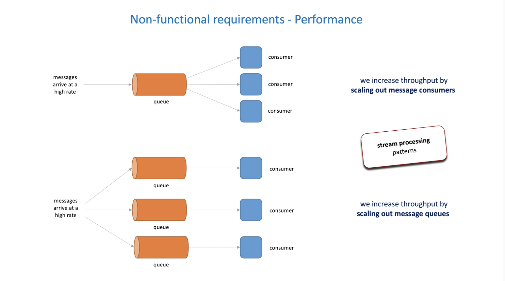
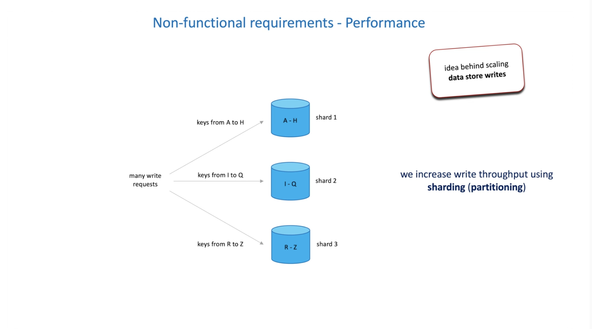

# 4. Performance

The time required to process something or rate at which something is processed

1. Latency and throughput
1. Percentiles
1. How to increases write and read throughput
1. Bandwidth

time = latency
throughput = rate

#### 1. latency

**software engineer**

> I'd rather clarify what exactly she mwans by latency 🤔

How do we improve latency

1. network latency

   1. OSI model
   1. network protocols

1. server-side latency

   1. faster algorithms
   1. memory versus disk trade-offs
   1. thread pools and parallel processing
   1. local cache

1. client-side latency
   1. blocking versus non-blocking I/O
   1. message compression
   1. data compression
   1. content delivery network
   1. external cache

Avarage latency

Percentile latency

> p99 will become our SLO and put promise to customers will be the SLA

#### 2. throughput

rate at which somthing is processed

1. requests per second
1. database queries per minute
1. network packets per hour

Higher the throughput, better the perfromance

How do we increase throughput?

1. decrease latency
1. scale up and/or out

Examples

1. when you need to process a big file, you can split it into chunks and process each chunk in parallel
   

1. When you have a queue and the messages arrive at a fast, rate, you can increase the number of queues
   

1. Increasing throughput of write operations, we can use sharding
   

1. Increasing throughput of read operations
   

Important to also talk about bandwidth

> bandwidth is the maximum rate of data transfer accross a given path (bits per second)

Bandwith = tube
Through = water

Sometimes we need a larger tube to increase throughput
