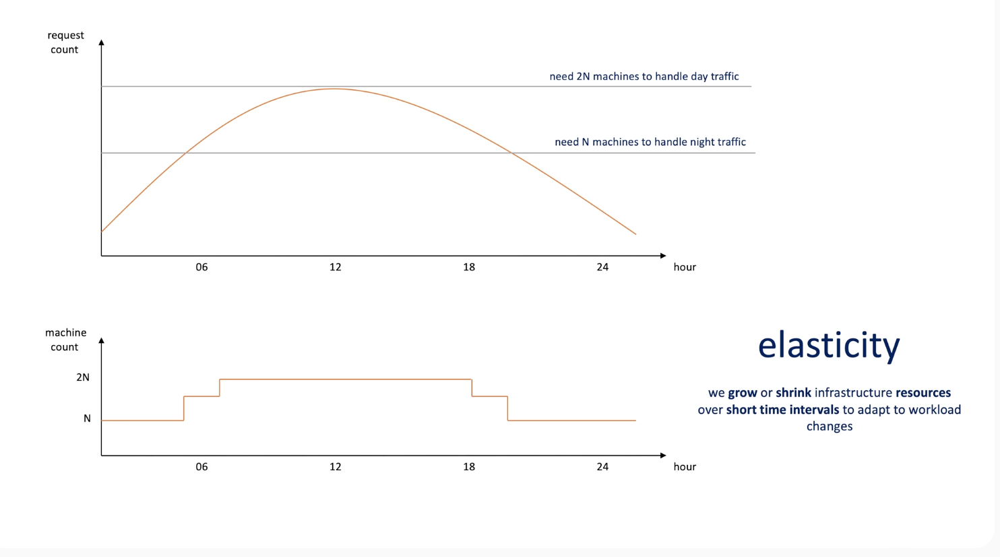
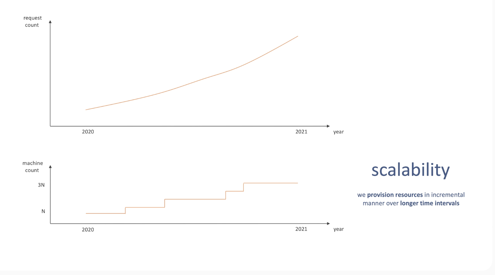
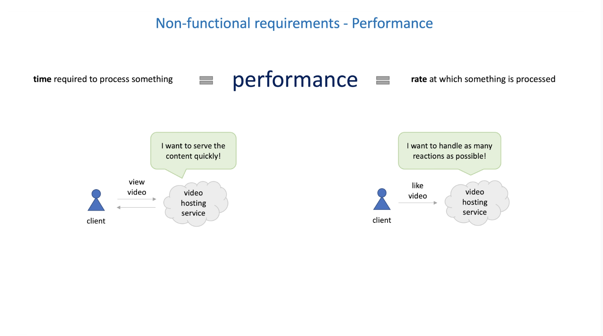
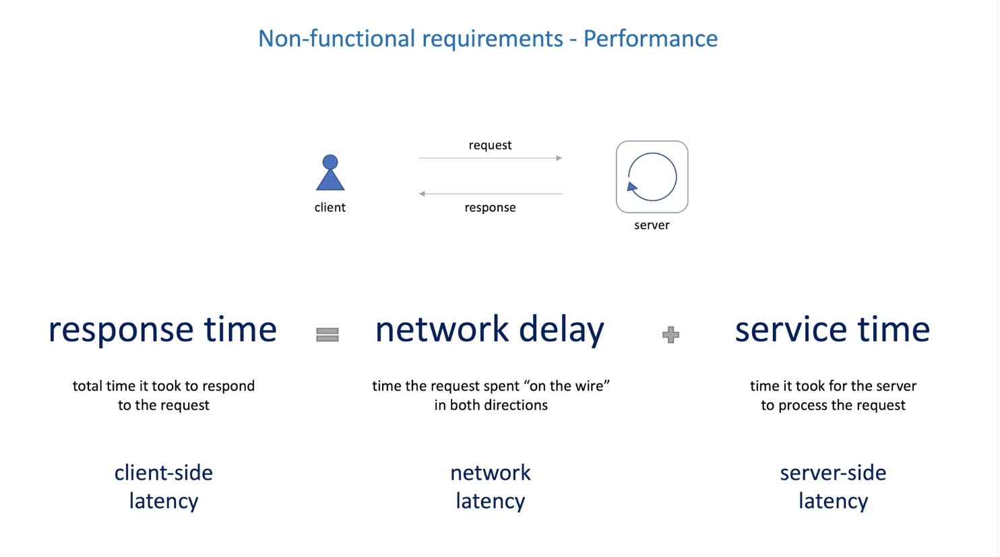
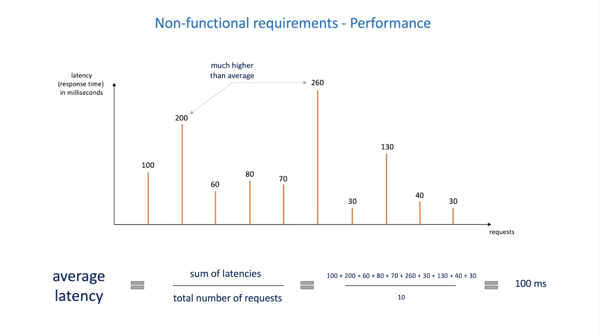
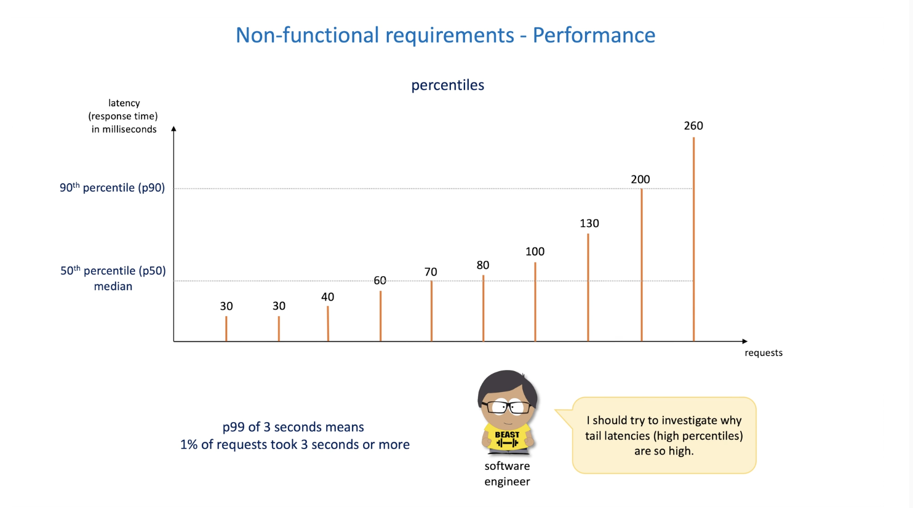
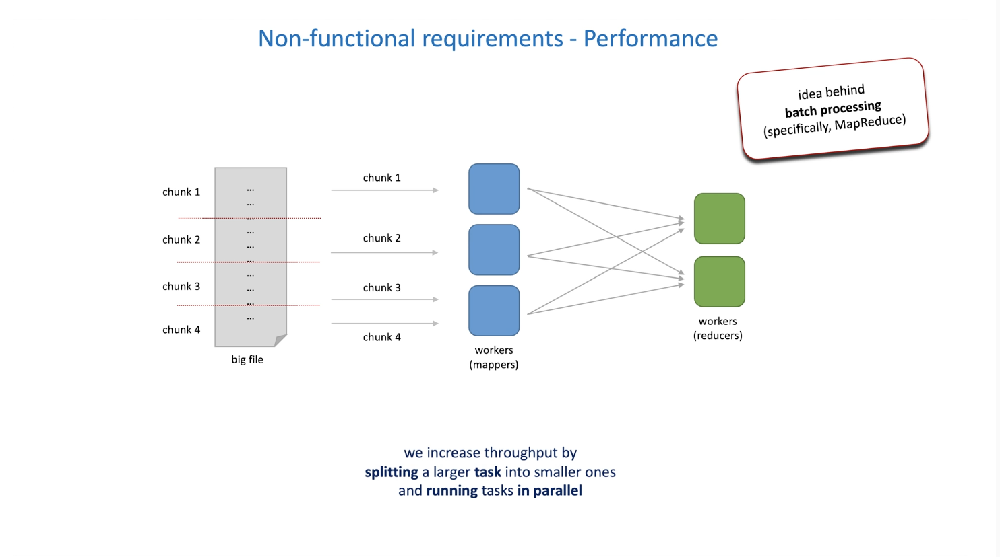
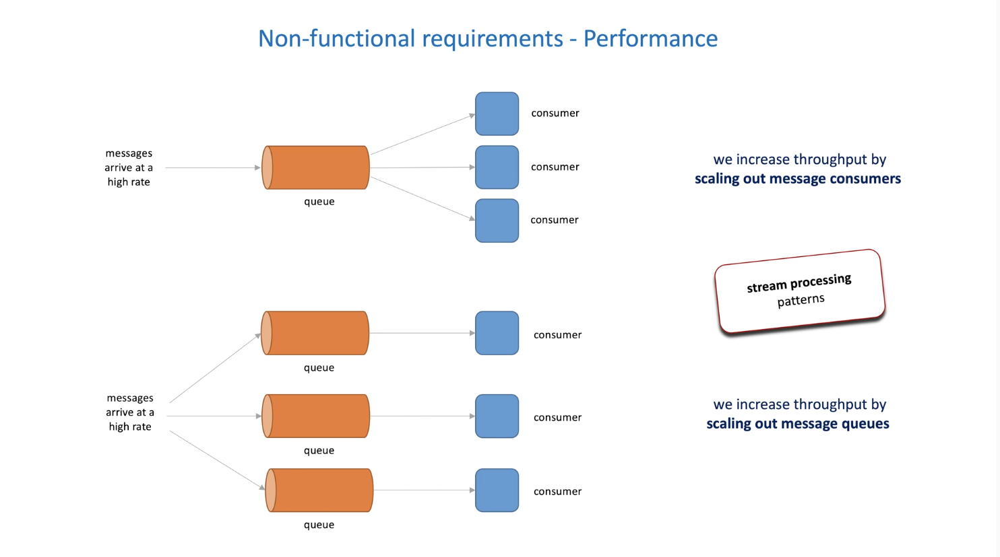
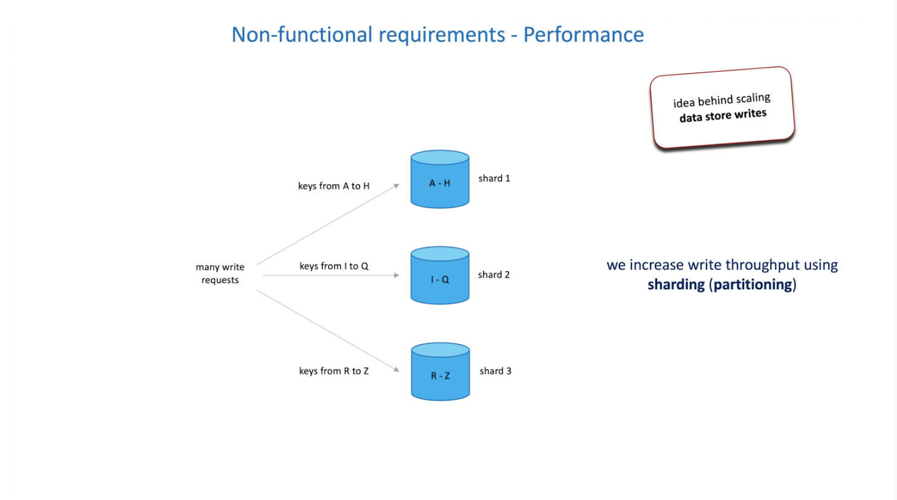
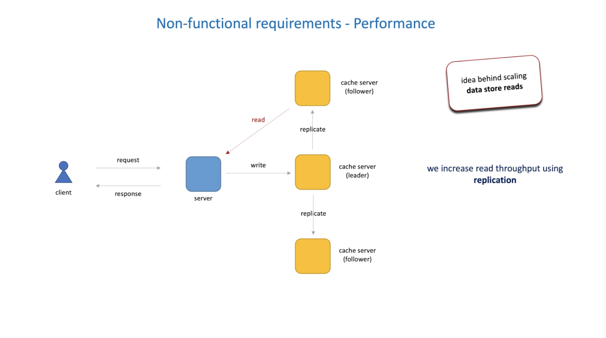

# System requirements

1.  What are the functional and non-functional requirements
1.  Why are they so important

[**functional requirements**](#1-functional-requirements)

> Define system **behavior**, what a system is supposed to do

example:

1. The system must allow applications to exchange messages

[**non-functional requirements**](#2-non-functional-requirements)

> Defines the **qualities** of a system how a system is supposed to be

Example:

1. Scalable
1. Highly available
1. Fast

**interviewer**

> Let me state the problem ambigously and see how the candidate approaches it

**interviewee**

> The problem seems too big. I should try to define specific functions and reduce the scope

> Also, I need ot figure out non-functional requirements and use my knowledge of system design concepts and patterns to address each requirement.

Hmm.. Let me think...

> Here are some fundamental concepts that help design scalable, highly available, and fast systems

1. Scale writes

   1. hash-based partitioning
   1. Bounded queue
   1. append-only logs
   1. emedded database
   1. B-tree database
   1. LSM-tree database

1. Scale reads

   1. push vs pull
   1. long polling

1. availability

   1. leader-based replication
   1. leaderless replication
   1. leader election
   1. coordination service
   1. cstring consistency
   1. load shedding
   1. rate limiting
   1. shuffle sharding
   1. reverse proxy
   1. service discovery
   1. request routing

1. fast

   1. bathcing
   1. Compression

The most important thing to remember is that the interview is your team mate and should help you decide what decision to make.

**Interviewer**

> I will help you define requirements.

> I do interviews to hire, not to reject

> My goal is to collect data points, not see you get stucka nd suffer

**summary**

1. Define functional requirements
1. Define non-functional requirements
1. Order non-functional requirements according to their importance
1. use this list as a tie breaker considering multiple design options and trade-offs

## 1. Functional requirements

1. How to define functional requirements
1. Working backwards approach

**how to define functional requirements**

> Start with the customer and work backwards

1. Who are the customers
1. How will they use the systems

ex. for youtube

1. Youtube users/customers

   1. Content creators
   1. Content viewers

1. How do the customers use the sytems
   1. Content creators
      1. upload videos
      1. create posts
      1. view analytics
   1. Content viewers
      1. search for videos
      1. watch videos
      1. leave comments

For entry positions the interviewer may be more specific, for seniors the questions may be more ambiguious. The interviewer want to see how you deal with ambiguos questions, break it down to smaller manageable pieces

> Let's design a YouTube-like system. Here are the use cases. Let's convert them to API first.

1. Upload a video to the channel
1. Return a list of videos for the channel, ordered by popularity
1. Search for videos and channels
1. Watch the specific video
1. Delete the specific video

## 2. Non-Functional requirements

Types of non-functional requirements

### 1. High availability

1. Time-based and count-based availability
1. Design principles behind availability
1. Processes behind high availability
1. SLO and SLA

**Success ration** of requests (count-based)

**availability** = system uptime, the percentage of time the system has been working and available (timebased)

1 out of 100 = **99%** - the system was unavailable about 3.65 days a year

> The server may be 100% fine but the request may fail. Availability should be seen from the client perspective and not the developer's. Perspective matters. The client's experience.

What does high availability really mean?

> 98%, 99% or 100% ? these lead to really complex and expensive and almost never justified for distributed systems. Software and hardware is never perfect and there could always be problems. None of these above is the goal for high availability

It is not about a number, it is about the **architechture** and **process**

> If the single server goes down, then the whole application system becomes unavailable, and no one knows when it will become available again

Systems are not static, they change.

1. We will add new features to the system
1. We will find and fix bugs
1. The load of the system may increase
1. We have to upgrade software
1. We have to apply security patches

> We need processes that help us safely make regulary changes to the system while maintaining high availability

**design principles behind high availability**

1. Build redundancy to eliminate single points of failure

   1. regions
   1. availability zones
   1. fallback
   1. data replication
   1. high availability pair

1. Switch from one server to another without losing data

   1. DNS
   1. Load balancing
   1. reverse proxy
   1. api gateway
   1. peer discovery
   1. service discovery

1. Protect the system from atypical client behavior (like too many expensive client requests)

   1. Load shedding
   1. Rate limiting
   1. Shuffle sharding
   1. Cell-based architecture

1. Protect the system from failures and performance degradation

   1. timeouts
   1. circuit breaker
   1. bulkhead
   1. retries
   1. idemprotency

1. Detect failures as they occur
   1. monitoring

**processes behind high availability**

> For Highly availabile systems a high uptime value is not the goal, it is a by product because is designed, implemented and maintained as such

1. Change management

   1. All code and configuration changes are reviewed and approved

1. QA

   1. Regularly exercise test to validate that newly introduced changes meet functional and non-functional requirements

1. deployment

   1. deploy changes to a production environement frequently, quickly, safely
   1. automated rollback quickly when errors are detected

1. Capacity planning

   1. Monitor system and add resources to meet growing demand

1. disaster recovery

   1. recover system quickly in the event of a disaster
   1. regularly test failover to distater recovery

1. Root cause analysis

   1. When a failure happens, establish the root cause of the failure and identify preventive measures

1. Operational readiness review

   1. evaluate system's operational state and identify gaps in operations
   1. define actions to remediate risks

1. game day

   1. during a game day, we simulate a failure or event and test system and team responses

1. team culture
   1. good team promotes process discipline

**software developer**

Service Level Objective (SLO)

> my system is highly available. It guarantees a monthly uptime percentage of 99.99% (LSO). If you experience lower availability, I will refund you

Service Level Agreement (SLA)

> The commitment between service providers and clients of our system is called an SLA (Service Level Aggreement).

### 2. Fault tolerance, resilience, reliability

> Fault tolerance is the property that enable a system to continue operating properly in the event of one or more faults within some of its components

1. Error, fault, failuer
1. Fault tolerance
1. Resilience
1. Game day vs chaos engineering
1. Expected and unexpected failures
1. Reliability

**software engineer**

> sometimes I make mistakes **errors**. Oops.. I have got a bug (**fault**)

And, it may cause a failure of one of my components.

**customer**

> Because your system is fault-tolerant, I do not see any **failures**

A highly availability system accepts the fact that downtime is possible and the system tries to minimize it.

A fault tolerant system has the goal of zero downtime.

> A car and an aeroplane analogy. In a car, we have an extra tire. Incase of one tire failure, we can stop the car and quickly change the broken tire. There is a downtime but it's short. Think of a car as a highly available system. An aeroplane can't stop in case of a failed engine. Other engines have to take over to ensure zero downtime. Not forever but till the next stop. An aeroplane is a fault tolerant system.

1. Achieved by using the same design principles and processes as for high availability
1. Requires even more redundancy typically highly than required in highly availability
1. Results in a higher cost

we can interchangebly use the fault tolerant with high availability

**resilience**

Ability to quickly recover from failures

Enigneer

> **Note**: I need faults to happen in my sytem periodically to test resilience (fault tolerance)

Chaos engineering rocks!

> Randomly killing an instance of a server to help simulates various system failures. Chaos engineering may remind you of the game day process mentioned earlier, but not the same. Game day is more focused on the team and the sections. They help the team to build muscle memory on how to respond to events. Chaos engineering is forcused on system behavior. It's goal is to automate experiments and run them continuosly in production

**reliability**

This means the system always performs its intended functions correctly and in time

1. High availability
1. Correctness
   > System returns the correct result
1. In time
   > system replies back within an acceptable time

System know how to handle expected failures (reliability & high availability):

1. server crash
1. power outage in a data center
1. network problems

System knows how to handle unexpected failures (fault tolerant & resilience):

1. load spikes
1. dependency failures

### 3. Scaling

The property of a system to handle a growing load

1. Requests per second
1. volume of incoming or outgoing data
1. number of concurrent connections etc.

Ways to scale

1. Vertical scaling

   1. More client
   1. More CPU / bigger server

1. Horizontal scaling (scaling out / shared-nothing architechture – SNA)
   1. More clients
   1. Add more machines to the system

> Typical you would prefer to scale horizontally. Vertical scaling is limited as the bigger or more powerful machines might be expensize. However you can always add more machines to the systems while growing horizontally

Problems to solve with horizontal scaling

1. service discovery
1. load balancing
1. request routing problem
1. maintenance

**softwate engineer**

> I still think that every system must run on multiple machines these days. It allows to have redundant machines in the system. Thus, increases availability.

> however, it is possible to achieve high availability in a single machine (almost.. ) system. Relational databases and load balancers often use active/passive setup for this.

Horizonal and vertical scaling can be used in conjunction

**Elasticity**

the ability of a system to acquire resources as it needs them, and release resources when it no longer needs them. $elasticity \ne scalability$

Elasticity is about short-term, tactical needs. Maybe the requests are higher during the day and lower in the evening. You can set 2N machines working when requests are high and 1N when requests are low as needed.

Elasticity helps to reduce costs

Scalability is about long-term, strategic needs. As our system grows throughout the year we can plan to deploy more resources to keep up the growing demands/requests.

### 4. Performance

The time required to process something or rate at which something is processed

1. Latency and throughput
1. Percentiles
1. How to increases write and read throughput
1. Bandwidth

time = latency
throughput = rate

#### 1. latency

**software engineer**

> I'd rather clarify what exactly she mwans by latency 🤔

How do we improve latency

1. network latency

   1. OSI model
   1. network protocols

1. server-side latency

   1. faster algorithms
   1. memory versus disk trade-offs
   1. thread pools and parallel processing
   1. local cache

1. client-side latency
   1. blocking versus non-blocking I/O
   1. message compression
   1. data compression
   1. content delivery network
   1. external cache

Avarage latency

Percentile latency

> p99 will become our SLO and put promise to customers will be the SLA

#### 2. throughput

rate at which somthing is processed

1. requests per second
1. database queries per minute
1. network packets per hour

Higher the throughput, better the perfromance

How do we increase throughput?

1. decrease latency
1. scale up and/or out

Examples

1. when you need to process a big file, you can split it into chunks and process each chunk in parallel
   

1. When you have a queue and the messages arrive at a fast, rate, you can increase the number of queues
   

1. Increasing throughput of write operations, we can use sharding
   

1. Increasing throughput of read operations
   

Important to also talk about bandwidth

> bandwidth is the maximum rate of data transfer accross a given path (bits per second)
